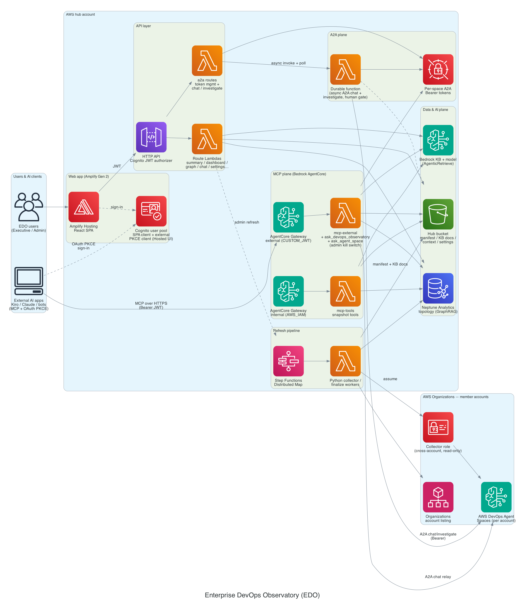

# Guidance for Enterprise DevOps Agent Observatory on AWS

Collect **AWS DevOps Agent** topology and investigations from every account in an
organization, centralize them in an S3 bucket in a **hub** account, build a
**Neptune Analytics** graph of cross-account service relationships, and make it
all queryable through an **Amazon Bedrock** managed knowledge base chat.

**Important:** This is sample code for demonstration and non-production usage. You should work with your security and legal teams to meet your organizational security, regulatory, and compliance requirements before deployment.

**Security considerations for production:** User authentication should align with your enterprise security policies. This sample code uses Amazon Congnito with DISABLED SignUp feature. Each user should be configured manually by approved administrator.

## Table of Contents

1. [Overview](#overview)
    - [Architecture](#architecture)
    - [Knowledge base](#knowledge-base)
    - [Cost](#cost)
    - [Sample Cost Table](#sample-cost-table)
2. [Prerequisites](#prerequisites)
    - [Operating System](#operating-system)
    - [Third-party tools](#third-party-tools)
    - [AWS account requirements](#aws-account-requirements)
    - [Supported Regions](#supported-regions)
3. [Deployment Steps](#deployment-steps)
4. [Deployment Validation](#deployment-validation)
5. [Running the Guidance](#running-the-guidance)
6. [Next Steps](#next-steps)
7. [Cleanup](#cleanup)
8. [FAQ, known issues, additional considerations, and limitations](#faq-known-issues-additional-considerations-and-limitations)
9. [Authors](#authors)

## Overview

AWS DevOps Agent learns each account's infrastructure topology and investigates
operational incidents, but that knowledge is siloed per account and per agent
space. This Guidance **centralizes** it: it collects the topology and
investigations from every account in an AWS Organization into a single **hub**
account, derives a **cross-account relationship graph**, and exposes the result
both as an interactive graph and as a natural-language chat grounded in the
collected data.

DevOps Agent has no single "export topology" API, so the pipeline collects
everything the `devops-agent` API (IAM prefix `aidevops`) exposes and derives the
graph from it:

- **Topology** — `ListAssociations` (AWS-account + GitHub/GitLab/Datadog/… links)
  and `ListAssets` + `GetAssetContent` (skills, memories, artifacts), plus asset
  types.
- **Incidents / investigations** — `ListBacklogTasks` filtered to `INVESTIGATION`
  tasks (the agent's investigation of an operational incident, so incident ==
  investigation), `ListJournalRecords` per execution, and `ListRecommendations`.

Because the linked accounts joined the organization by **invitation**, they have
no `OrganizationAccountAccessRole`. The org has **all-features** enabled and
**CloudFormation StackSets trusted access** on, so a read-only
`DevOpsAgentCollectorRole` is pushed into every account with a **service-managed
StackSet** (the management account gets a standalone stack). The hub then assumes
that role, guarded by an `ExternalId`.

### Architecture



*Full solution: the Amplify-hosted SPA and JWT-protected API, the data & AI
plane (hub S3 bucket, Neptune Analytics GraphRAG, Bedrock knowledge base), the
Step Functions refresh fan-out across member accounts, the A2A plane (durable
function + per-space tokens talking to DevOps Agent Spaces), and the MCP plane
(internal and external Bedrock AgentCore Gateways — external AI apps like Kiro
or Claude connect with the user's own EDO credentials via OAuth PKCE).
Regenerate with `python3 docs/architecture.py`.*

The hub data pipeline in detail:

```
                 (management: default)                       (hub: 123456789012)
  Organizations ──ListAccounts──► collect.py ──assume DevOpsAgentCollectorRole──► each linked acct
  StackSet ──deploys role──► every account            │  devops-agent: list/get topology+investigations
                                                       ▼
                                          s3://devops-agent-hub-.../raw/**   (raw JSON)
                                                       │  transform_to_graph.py
                                                       ▼
                                          s3://devops-agent-hub-.../graph/{nodes,edges}.csv
                                                       │  Neptune Analytics import
                                                       ▼
                                          Neptune Analytics graph  ── openCypher ──► cross-account queries
                                                       │  build_kb_docs.py → Bedrock managed KB
                                                       ▼
                                          Bedrock knowledge base ── RetrieveAndGenerate ──► chat
```

**Graph model.** Nodes: `Account`, `AgentSpace`, `Association`, `ExternalTarget`,
`Investigation`, `Recommendation`, `Asset`, `AwsService`. Edges: `HAS_SPACE`,
`HAS_ASSOCIATION`, `TARGETS_ACCOUNT` (cross-account), `TARGETS_EXTERNAL`,
`HAS_INVESTIGATION`, `HAS_RECOMMENDATION`, `HAS_ASSET`, `USES_SERVICE`,
`REFERENCES_SERVICE`. Cross-account relationships surface where agent spaces in
**different accounts** reference the **same** node (an AWS account, an
`AwsService`, or a shared `ExternalTarget` such as one GitHub org or Datadog
environment).

### Knowledge base

A **fully managed** Bedrock knowledge base (`type=MANAGED`) indexes the collected
DevOps Agent data so you can ask about cross-account topology and investigations
in natural language. Bedrock manages the vector store (S3 Vectors underneath) —
there is no OpenSearch cluster or vector index to operate.

- **Embeddings**: `amazon.titan-embed-text-v2:0` (1024-dim).
- **Chat / generation**: Claude Sonnet 4.5 via `RetrieveAndGenerate` (managed RAG
  with citations back to the S3 source docs).
- **Data source**: the `kb/` docs produced by `07_build_kb_docs.py` — one doc per
  account and per agent space, each with a `.metadata.json` sidecar so answers
  can be filtered by account.
- **Cost**: pay-per-use (embedding + query tokens, plus cheap managed vector
  storage). No standing per-hour compute charge, unlike OpenSearch Serverless.

### Cost

_You are responsible for the cost of the AWS services used while running this
Guidance. As of July 2026, the cost for running this Guidance with the default
settings in the US East (N. Virginia) Region is approximately **$340 per month**
if the Neptune Analytics graph runs continuously, or roughly **$10–30 per month**
if the graph is torn down between refreshes (the recommended pattern)._

Amazon Neptune Analytics is the dominant cost — it bills per m-NCU-hour for as
long as the graph exists (default `128` m-NCU in `config.env`). Everything else
is pay-per-use or near-free. Always run the Neptune cleanup when finished.

_We recommend creating a [Budget](https://docs.aws.amazon.com/cost-management/latest/userguide/budgets-managing-costs.html)
through [AWS Cost Explorer](https://aws.amazon.com/aws-cost-management/aws-cost-explorer/)
to help manage costs. Prices are subject to change. For full details, refer to
the pricing webpage for each AWS service used in this Guidance._

### Sample Cost Table

The following table provides a sample cost breakdown for deploying this Guidance
with the default parameters in the US East (N. Virginia) Region for one month.

| AWS service | Dimensions | Cost [USD] |
| ----------- | ---------- | ---------- |
| Amazon Neptune Analytics | 128 m-NCU graph; ~730 hrs/month if left running (tear down between refreshes to avoid) | $ 328.00/month |
| Amazon Bedrock | Titan Text v2 embeddings for ~15 KB docs + ~1,000 chat queries (Claude Sonnet 4.5), pay-per-use | $ 10.00/month |
| Amazon S3 | Hub data lake (< 5 GB) + requests | $ 1.00/month |
| AWS Lambda + Amazon API Gateway | Web-app API, < 100,000 requests/month | $ 1.00/month |
| AWS Amplify Hosting | 1 app, build minutes + static hosting | $ 3.00/month |
| Amazon Cognito | < 50 monthly active users | $ 0.00 |
| AWS Step Functions + AWS Fargate | Occasional refresh runs | $ 1.00/month |

## Prerequisites

### Operating System

These deployment instructions are optimized to best work on **macOS or Amazon
Linux 2023**. Deployment on another OS may require additional steps. You need:

- **Python 3.9+** with **boto3/botocore ≥ 1.43.36** (the version that ships the
  `devops-agent` client): `pip3 install --upgrade boto3 botocore`
- **AWS CLI v2**, configured with the profiles referenced in `config.env`.
- **Node.js 18+ / npm 9+** (only for the executive web app).
- **git** to clone the repository.

### Third-party tools

- **Docker** — optional, only if you want to run the Amazon Neptune Graph
  Explorer container for live visual exploration.

### AWS account requirements

- An **AWS Organization** with **all features** enabled and **CloudFormation
  StackSets trusted access** turned on.
- Three account roles (defaults use placeholder IDs; set real values in
  `config.env`):

  | Role       | Account        | CLI profile     | Purpose                                   |
  |------------|----------------|-----------------|-------------------------------------------|
  | Management | `210987654321` | `default`       | AWS Organizations + deploys the StackSet  |
  | Hub        | `123456789012` | `123456789012`  | S3 data lake + Neptune Analytics graph    |
  | Linked     | 4 more members | (assumed role)  | Source of DevOps Agent data               |

- **Amazon Bedrock model access** in the hub account for
  `amazon.titan-embed-text-v2:0` (embeddings) and Claude Sonnet 4.5 (chat).
- **AWS DevOps Agent** enabled with at least one agent space per account (see
  [Next Steps](#next-steps)).

All settings live in [`config.env`](config.env) (copy from
[`config.env.example`](config.env.example)).

### Supported Regions

AWS DevOps Agent used by this Guidance is available only in **US East (N.
Virginia) — `us-east-1`**, so deploy all resources there.

## Deployment Steps

1. Clone the repo and enter it:
   ```bash
   git clone <repository-url>
   cd devops-observatory-amplify
   ```
2. Create your configuration from the template and fill in real account IDs,
   profiles, and settings:
   ```bash
   cp config.env.example config.env
   # edit config.env
   ```
3. Bootstrap the read-only collector role org-wide (**management** creds). This
   is an **org-wide change** — it creates an IAM role in every account:
   ```bash
   cd scripts
   python3 01_deploy_collector_roles.py
   python3 01_deploy_collector_roles.py --status
   ```
4. Create the hub data-lake bucket (**hub** creds):
   ```bash
   python3 02_create_hub_bucket.py
   ```
5. Collect topology + investigations into S3 (**hub** creds; assumes the
   collector role per account):
   ```bash
   python3 03_collect.py
   ```
6. Transform the raw JSON into Neptune load CSVs in S3 (**hub** creds):
   ```bash
   python3 04_transform_to_graph.py
   ```
7. Provision Neptune Analytics and load the graph (**hub** creds).
   **Billed per m-NCU-hour while the graph exists:**
   ```bash
   python3 05_provision_neptune_and_load.py
   ```
   The graph is created **VPC-only** by default, so the closing sample query is
   skipped unless you run this from inside the VPC (or set
   `NEPTUNE_PUBLIC_CONNECTIVITY=true` for a development deployment). See
   [Running the Guidance](#running-the-guidance).
8. Render the collected data into knowledge-base docs and create the managed
   Bedrock knowledge base (**hub** creds):
   ```bash
   python3 07_build_kb_docs.py
   python3 08_provision_knowledge_base.py
   ```
9. (Optional) Deploy the executive web app (Amplify Gen 2). If this is your
   first time using AWS CDK/Amplify in the account, bootstrap it first, then
   deploy — see [`webapp/OPERATIONS.md`](webapp/OPERATIONS.md) for hosting setup
   and environment variables.

## Deployment Validation

- **Collector role**: `python3 scripts/01_deploy_collector_roles.py --status`
  lists a stack instance per account.
- **Collection**: confirm objects exist under
  `s3://<hub-bucket>/raw/` and a `raw/_manifest.json` is present.
- **Graph**: open the Neptune Analytics console and verify the graph is
  `AVAILABLE`, and that the import task reports the expected node/edge counts.
  To validate by query, run `python3 scripts/06_query_examples.py` **from inside
  the VPC** — the graph is VPC-only by default, so this times out from a laptop
  (see [Running the Guidance](#running-the-guidance)).
- **Knowledge base**: `python3 scripts/08_provision_knowledge_base.py --status`
  reports the KB, its data source, and the latest ingestion job — expect
  `ACTIVE` / `AVAILABLE` and an ingestion of `COMPLETE`. The flag is read-only.
  The Bedrock console shows the same thing.
- **Web app**: the Amplify build succeeds and the branch URL returns HTTP 200.

## Running the Guidance

**Chat over the knowledge base** (hub creds):
```bash
python3 scripts/09_chat.py                                   # interactive
python3 scripts/09_chat.py "which accounts connect to GitLab?"   # one-shot
```
Expected output: a natural-language answer grounded in the collected data, with
citations back to the S3 source docs (one doc per account and per agent space).

**Run more cross-account graph queries** (hub creds, **from inside the VPC**):
```bash
python3 scripts/06_query_examples.py
```

> **Graph reachability.** By default the Neptune Analytics graph is created
> **VPC-only** (`NEPTUNE_PUBLIC_CONNECTIVITY=false`), so the network remains a
> second line of defence alongside IAM/SigV4 auth. Anything that speaks
> openCypher directly to the graph — `06_query_examples.py`, step 5's sample
> query, Graph Explorer, a Jupyter notebook — must therefore run somewhere with
> VPC access: an EC2 instance or ECS task in the VPC, a Neptune notebook, or
> your workstation over VPN/Direct Connect. From a laptop with no VPC route the
> connection simply times out.
>
> Chat (`09_chat.py`) and the web app are unaffected — they read the Bedrock
> knowledge base and S3, not the graph endpoint.
>
> For a development-only deployment you can set
> `NEPTUNE_PUBLIC_CONNECTIVITY=true` in `config.env` before step 7 to query from
> anywhere. Access is still IAM-authenticated, but the graph endpoint is then
> exposed to the public internet and a leaked or overly broad credential is
> enough to read the whole topology. Not recommended outside development.

**Visualize the graph** — easiest first:

1. **Self-contained HTML** (instant, no infra) — renders `graph/*.csv` from S3
   into an interactive page:
   ```bash
   python3 scripts/11_visualize_graph.py && open graph.html
   ```
   This one works from anywhere — it reads the CSVs from S3 and never touches
   the graph endpoint.
2. **Neptune Graph Explorer** (live, no-code UI) — run this **inside the VPC**
   (for example on an EC2 host in the VPC) unless you have enabled public
   connectivity:
   ```bash
   docker run -it -p 8080:80 -p 443:443 \
     -e HOST=g-0123456789.us-east-1.neptune-graph.amazonaws.com \
     -e NEPTUNE_GRAPH_TYPE=neptune-analytics \
     -e AWS_REGION=us-east-1 \
     -e USING_PROXY_SERVER=true \
     public.ecr.aws/neptune/graph-explorer:latest
   # then open https://localhost/explorer and add the graph connection
   ```
3. **Neptune / Jupyter notebook** with openCypher `%%oc` magics against the graph
   endpoint (`%graph_notebook_service neptune-graph`).

All three require AWS credentials for the hub account (IAM/SigV4 auth), and
options 2 and 3 additionally require network reachability to the graph endpoint
as described above.

## Next Steps

- **Every account needs an agent space.** Check and bootstrap them org-wide:
  ```bash
  python3 scripts/ensure_agent_spaces.py --check-only    # report per account
  python3 scripts/ensure_agent_spaces.py                 # create where missing
  python3 scripts/ensure_agent_spaces.py --account 345678901234   # one account
  ```
  Linked accounts are reached via the assumed `DevOpsAgentCollectorRole`, so to
  *create* spaces there set `ALLOW_AGENT_SPACE_CREATION=true` in `config.env`
  before step 3 (adds `aidevops:CreateAgentSpace`; read-only otherwise). Flip it
  back to `false` and redeploy once bootstrapping is done.

  A per-account summary is kept in the hub at
  `s3://<hub-bucket>/hub/agent_spaces_all.json`. `ensure_hub_agent_space.py`
  remains for the hub-only case; `ensure_agent_spaces.py` covers the whole org.
- **Refresh the data periodically.** The pipeline is idempotent; one command
  runs the whole refresh over resources that already exist:
  ```bash
  python3 scripts/10_refresh_all.py
  ```
  Collect/transform/KB-doc steps overwrite the same S3 keys (bucket versioning
  keeps history). Bedrock KB ingestion is incremental. Neptune bulk import
  requires an empty graph, so the refresh **resets then reloads** the graph so
  stale nodes are dropped cleanly. Schedule it with cron or, in AWS, with
  EventBridge Scheduler → Lambda / Fargate / Step Functions (collection fans out
  across accounts, so Fargate/Step Functions scales better than a 15-min Lambda).
- **Reduce Neptune cost between refreshes** with `StopGraph`/`StartGraph`, or
  delete and recreate the graph each cycle.

## Cleanup

Neptune Analytics and the knowledge base are the cost drivers — tear them down
when finished. Each script prompts for confirmation (`--yes` to skip):

```bash
# Neptune graph + snapshots + load role                      (HUB creds)
python3 scripts/cleanup_neptune.py

# Managed KB + data sources + KB role (leaves S3 docs)       (HUB creds)
python3 scripts/cleanup_kb.py

# The cross-account assumed role, org-wide (StackSet + mgmt)  (MANAGEMENT creds)
python3 scripts/cleanup_collector_roles.py
```

These leave the S3 bucket and its data intact (cheap, and your source of truth);
delete the bucket manually for a full teardown. If you deployed the web app,
remove its Amplify branch/app in the Amplify console (or `ampx sandbox delete`
for a sandbox).

## FAQ, known issues, additional considerations, and limitations

**Optional script flags**

Beyond the deployment steps above, the pipeline scripts accept a few flags:

| Command | Effect |
| ------- | ------ |
| `01_deploy_collector_roles.py --status` | List the StackSet instance per account |
| `05_provision_neptune_and_load.py --snapshot` | Snapshot the graph before the reset+reload |
| `05_provision_neptune_and_load.py --delete` | Delete the graph and its load role |
| `08_provision_knowledge_base.py --sync` | Re-ingest after new data (incremental) |
| `08_provision_knowledge_base.py --status` | Report KB, data source and latest ingestion (read-only) |
| `08_provision_knowledge_base.py --delete` | Tear down the KB and its data sources |
| `06_query_examples.py <query_name>` | Run one named example instead of all |

To refresh manually rather than with `10_refresh_all.py`, re-run steps
`03` → `04` → `07` → `08 --sync`.

**Additional considerations**

- **Neptune Analytics is the only meaningful cost** — it bills per m-NCU-hour for
  as long as the graph exists (default `128` m-NCU). Always tear it down when
  done.
- The graph is created **VPC-only** by default (`publicConnectivity=False`), so
  access requires both IAM/SigV4 auth *and* network reachability. openCypher
  tooling therefore has to run inside the VPC — see
  [Running the Guidance](#running-the-guidance). Setting
  `NEPTUNE_PUBLIC_CONNECTIVITY=true` in `config.env` exposes the endpoint to the
  internet so you can query from a laptop; it remains IAM-authenticated, but IAM
  becomes the only perimeter. Intended for development only.
- The collector role is **read-only** (`aidevops:List*/Get*/Describe*`) and scoped
  to the hub account via an `ExternalId`.
- The collector role attaches its permissions as an **inline policy** rather than
  a customer-managed policy. Some IAM linters flag inline policies on roles as a
  matter of course. It is deliberate here: the policy is single-purpose and scoped
  1:1 to `DevOpsAgentCollectorRole`, it is deployed uniformly to every account by
  the same StackSet, and it is never shared with another principal — so a managed
  policy would add an indirection without any reuse benefit, and would leave a
  detached policy behind on cleanup. Keeping the grant inline also means the role
  and its permissions are created, updated, and deleted as a single unit. If your
  organization mandates managed policies, move the `Policies` block in
  `cloudformation/collector-role.yaml` into an `AWS::IAM::ManagedPolicy` resource
  and attach it via `ManagedPolicyArns` (the `MonitorRole` in the same template
  already uses that pattern); the conditional statements carry over unchanged.
- This Guidance operates only in **us-east-1** because that is where AWS DevOps
  Agent is available.

For any feedback, questions, or suggestions, please use the issues tab of the
repository.

## Authors

- DevOps Observatory maintainers
